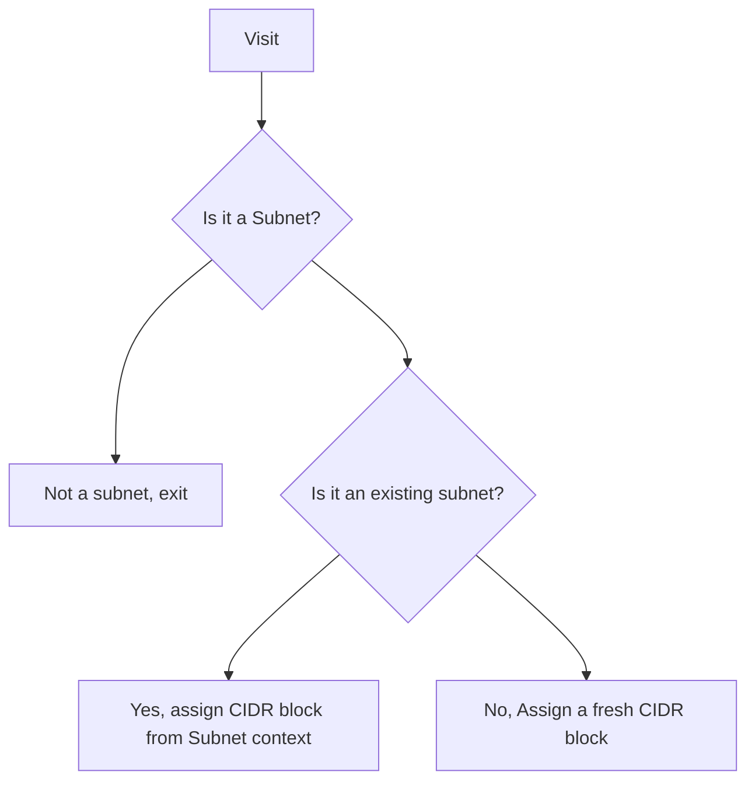

# CDK Aspect for VPC Stateful CIDR Block Assignment

This project provides a CDK Aspect that alters Amazon VPC subnet CIDR block assignments to respect existing CIDR blocks when updating a CDK VPC construct.

The VpcStatefulCidrBlockAssigner is designed to maintain consistency in VPC subnet CIDR blocks across deployments, ensuring that existing subnets retain their assigned CIDR blocks while allowing for the addition of new subnets.

## Considerations
This CDK Aspect does not follow CDK's best practices and is intended as a break-glass solution when the alternatives can't be used.

Specifically, this CDK Aspect uses a Subnet context file created by the user as a source of thruth for deployed and assigned CIDR blocks. To keep the existing assignments between CIDR Blocks and Subnets, this aspect utilize the [escape hatches](https://docs.aws.amazon.com/cdk/v2/guide/cfn_layer.html) mechanism.

### Preferred Alternatives
* Migrate existing CDK stack to use [VPCv2](https://docs.aws.amazon.com/cdk/api/v2/docs/@aws-cdk_aws-ec2-alpha.VpcV2.html)
* Replace existing CDK stack to a new CDK stack with updated configuration

### Aspect Prerequisites
* VPC construct declares AZs using `availabilityZones` prop and not `maxAzs` prop; E.g., `availabilityZones: ['us-east-1a', 'us-east-1b']`
* You can only apply aspect to a CDK construct tree containing up to one VPC
* VPC construct and provided VPC ID must match
* Only supports IPv4
* One CIDR block per VPC(?)

### General
* To ensure consistancy between deployments you must check in all `${VPC_ID}.subnets.context.json` files to your git repository, see [Subnet Context File](#subnet-context-file)
* Removing this aspect after first usage will cause deployment issues

### Supported actions
* Add and remove the last specified AZ in the `availabilityZones` prop; I.e., the right-most AZ
* Substitute any AZ with another


## Usage Instructions

### Installation

Prerequisites:
- Node.js (v14 or later)
- AWS CDK v2.177.0 or compatible version

To install the package in your project:

```bash
npm install cdk-aspect-vpc-stateful-cidr-block-assigner
```

### Getting Started

1. Import the VpcStatefulCidrBlockAssigner in your CDK stack:

```typescript
import { VpcStatefulCidrBlockAssigner } from 'cdk-aspect-vpc-stateful-cidr-block-assigner';
import * as cdk from 'aws-cdk-lib';
```

2. Apply the aspect to your VPC construct:

```typescript
const network = new Network(this, 'Network', {
  // ... your network construct configuration, this construct must contain up to one VPC construct
});


const vpcStatefulCidrBlockAssigner = new VpcStatefulCidrBlockAssigner({
  vpcId: 'vpc-01234567890abcdef'
});
cdk.Aspects.of(network).add(vpcStatefulCidrBlockAssigner, {
  priority: cdk.AspectPriority.MUTATING
});
```

### Configuration Options

The `VpcStatefulCidrBlockAssigner` accepts the following properties:

| Property | Type | Description | Example |
|----------|------|-------------|---------|
| vpcId | string | The ID of the VPC you want to manage. | 'vpc-01234567890abcdef' |
| contextFileDirectory | string (optional) | Custom directory path for the subnet context file. | 'path/to/context/' |
| availabilityZoneSubstitutions | Array<AvailabilityZoneSubstitution> (optional) | An array of AZ substitutions for reassigning CIDR blocks. | [{ source: 'us-east-1a', target: 'us-east-1b' }, { source: 'us-east-1c', target: 'us-east-1d' }] |

Example with all options:

```typescript
const vpcStatefulCidrBlockAssigner = new VpcStatefulCidrBlockAssigner({
  vpcId: 'vpc-01234567890abcdef',
  contextFileDirectory: 'path/to/context/',
  availabilityZoneSubstitutions: [
    { source: 'us-east-1a', target: 'us-east-1b' },
    { source: 'us-east-1c', target: 'us-east-1d' },
  ]
});
```

### Subnet Context File

The VpcStatefulCidrBlockAssigner relies on a subnet context file to maintain CIDR block assignments. This file should be named `{vpcId}.subnets.context.json` and placed in the project root or the specified `contextFileDirectory`.

To generate this file, use the following AWS CLI command:

```bash
export VPC_ID="{VPC ID}"
aws ec2 describe-subnets --filters Name=vpc-id,Values=${VPC_ID} --query "Subnets[*].{Name: Tags[?Key == 'aws-cdk:subnet-name'] | [0].Value, LogicalId: Tags[?Key == 'aws:cloudformation:logical-id'] | [0].Value, AvailabilityZone: AvailabilityZone, CidrBlock: CidrBlock}" > ${VPC_ID}.subnets.context.json
```

Replace `{VPC ID}` with your actual VPC ID.

## CIDR Block Assignment Flow



## Troubleshooting

### Common Issues

1. **Missing Subnet Context File**

   Error message: `Error reading subnet context file: {path}. Use provided script in README.md to generate.`

   Solution: Ensure you've generated the subnet context file using the AWS CLI command provided in the Usage Instructions section.

2. **Empty Subnet Context File**

   Error message: `Subnet context file is empty. Use provided script in README.md to generate.`

   Solution: Verify that the AWS CLI command executed successfully and produced a non-empty JSON file.

3. **Invalid JSON in Subnet Context File**

   Error message: `Error parsing subnet context file. Use provided script in README.md to generate.`

   Solution: Check the content of the subnet context file and ensure it's valid JSON. Regenerate the file if necessary.

4. **Multiple VPCs Error**

   Error message: `VpcStatefulCidrBlockAssigner can only be applied to a single VPC`

   Solution: Ensure that you're applying the VpcStatefulCidrBlockAssigner to only one VPC construct in your CDK stack.

5. **Availability Zone Conflict**

   Error message: `Availability Zone {az} must only appear in one of: Availability Zone in VPC, or as a source of AvailabilityZoneSubstitutions`

   Solution: Check your VPC configuration and AvailabilityZoneSubstitutions to ensure there are no conflicts. An AZ can't be in both VPC and AvailabilityZoneSubstitutions.
